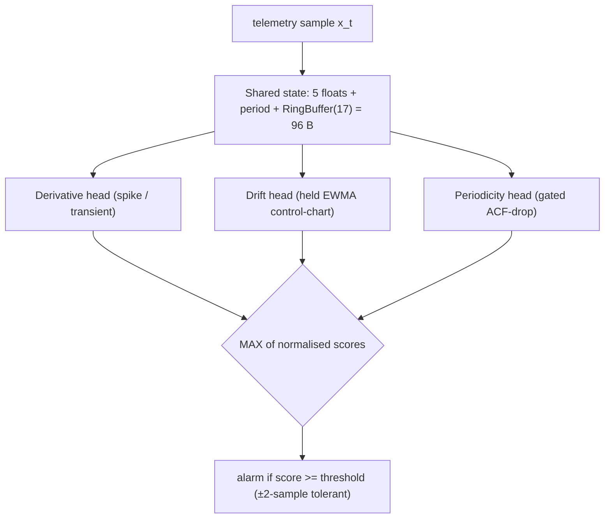

# Phase 4 — Solution Architecture & Full Evaluation Results

Lightweight time-series anomaly detection for on-device network telemetry under short windows
(10–50 samples) and a hard budget (**< 100 µs/sample, < 100 bytes/metric, streaming, basic
arithmetic**). This document gives the solution architecture as diagrams, followed by the full
evaluation results read directly from `Phase 4/results/`.

---

## 1. System architecture (runtime + evaluation harness, sharing one contract)

```
┌──────────────────────────────────────────────────────────────────────────────┐
│                         PHASE 4  SYSTEM ARCHITECTURE                            │
│                                                                                │
│   ┌─────────────────────────────┐         ┌──────────────────────────────┐    │
│   │   RUNTIME (on-device)        │         │   EVALUATION HARNESS          │    │
│   │   what ships to the switch   │◄──same──►│   what chose it               │    │
│   │                              │ contract │                              │    │
│   │  Detector contract:          │         │  datasets ─► sweep ─► metrics │    │
│   │   update(x)->score, <100B,   │         │   │           │        │      │    │
│   │   streaming, O(1)/O(window)  │         │   ▼           ▼        ▼      │    │
│   │                              │         │  synthetic  20 det × selection│    │
│   │  Python ref ◄─parity─► C twin│         │  + real NAB  4 win ×  (Pareto │    │
│   │  (tsad/)        (src/c/)      │         │             310 strm  + gate) │    │
│   └─────────────────────────────┘         └──────────────────────────────┘    │
│                    │                                      │                     │
│                    └──────────────┬───────────────────────┘                     │
│                                   ▼                                             │
│         results/  →  REPORT  +  DASHBOARD (React/ECharts)  +  CLI demo          │
└──────────────────────────────────────────────────────────────────────────────┘
```

## 2. The `unified` detector — single all-in-one solution (96 bytes)

```
                         ┌───────────────────────────────────────────┐
   telemetry             │   SHARED STATE  (96 bytes, allocated once) │
   sample x_t   ───────► │   5 float scalars + int period             │
   (one at a time)       │   + RingBuffer[17]  + counters             │
                         └───────────────────────────────────────────┘
                                   │ feeds all heads (no duplicated state)
            ┌──────────────────────┼───────────────────────┐
            ▼                      ▼                        ▼
   ┌─────────────────┐  ┌────────────────────┐   ┌────────────────────────┐
   │ DERIVATIVE head │  │ DRIFT head         │   │ PERIODICITY head        │
   │ |Δx| z-score,   │  │ held EWMA control- │   │ gated ACF-drop:         │
   │ anomaly-aware   │  │ chart, windowed σ, │   │ ARMED only if signal is │
   │ HOLD baseline   │  │ output CLIPPED     │   │ periodic (else SILENT)  │
   │ →spike/transient│  │ → drift            │   │ → periodicity loss      │
   └────────┬────────┘  └─────────┬──────────┘   └───────────┬────────────┘
            │ /TH_DRV             │ /TH_EWMV                  │ /TH_PER
            └──────────────┬──────┴───────────┬──────────────┘
                           ▼                  ▼
              score = MAX( norm_deriv, norm_drift, norm_periodicity )
                           │
                           ▼
              alarm if score ≥ threshold   (operator-tuned, ±2-sample tolerant)

   No-dilution tricks:  drift CLIP (a legit step can't out-shout a spike) ·
   periodicity GATE (silent on aperiodic bases) · state sharing (4 heads in 96 B,
   vs 424 B for naive 4-detector voting).
```

## 3. Evaluation → selection pipeline

```
  DATASETS                  SCORE EVERY (detector × window × stream)        SELECT
 ┌──────────────┐  Stream   ┌──────────────────────────────────────┐   ┌──────────────┐
 │ synthetic.py │ (values,  │           sweep_runner.py            │   │ scorecard +  │
 │  4 types,    │  labels,  │   det.update(x) ─► score series      │   │ pareto +     │
 │  spike ≥6σ   │  events)  │        │                             │   │ mapping      │
 │ injectors.py ├──────────►│        ▼                             │   │              │
 │ real NAB     │           │   metrics_intel.py:                  │   │  HARD GATE:  │
 │ (14 streams) │           │    • VUS-PR, F1, MCC (imbalance-aware)│  │  <100 µs AND │
 └──────────────┘           │    • event_f1_opt (operational)      ├──►│  <100 bytes  │
                            │   profile_cost.py + C bench:         │   │      │       │
                            │    • ns/sample, bytes (the budget)   │   │      ▼       │
                            └──────────────────────────────────────┘   │ selection.   │
                                       results/*.csv, metrics.json ───► │ json         │
                                                                        └──────────────┘
```




---

# Full Evaluation Results

Source: one full pipeline run — **20 detectors × 4 windows × 310 streams** (8 seeds; synthetic spike≥6σ + 14 real NAB). Metrics at each detector's best operating point. `event_f1_opt` = event-tolerant F1 (±2) at the operational threshold (the headline for point anomalies).

## Recommended configurations (budget-gated)

| role | detector | window | VUS-PR | F1 | µs/sample | bytes | within budget |
|---|---|---|---|---|---|---|---|
| overall | **deriv** | 30 | 0.365 | 0.708 | 0.0049 | 20 | ✅ |
| best single | **deriv** | 30 | 0.365 | 0.708 | 0.0049 | 20 | ✅ |
| best combined | **unified** | 20 | 0.423 | 0.684 | 2.3659 | 96 | ✅ |

## Condition → algorithm (best detector per anomaly type)

| anomaly type | detector | window | VUS-PR | F1 |
|---|---|---|---|---|
| spike | **unified** | 50 | 0.332 | 0.698 |
| drift | **ewmv_hold** | 50 | 0.900 | 0.899 |
| periodicity | **acf_periodicity** | 20 | 0.868 | 0.869 |
| transient | **unified** | 50 | 0.353 | 0.625 |
| real | **ewmv_hold** | 20 | 0.228 | 0.282 |

## The `unified` single all-in-one detector — event-F1 by type × window

| window | spike | drift | periodicity | transient | **min (4 types)** | bytes |
|---|---|---|---|---|---|---|
| 10 | 0.903 | 0.888 | 0.931 | 0.949 | **0.888** | 96 |
| 20 | 0.971 | 0.891 | 0.999 | 0.983 | **0.891** | 96 |
| 30 | 0.974 | 0.907 | 1.000 | 0.979 | **0.907** ✅ | 96 |
| 50 | 0.980 | 0.912 | 1.000 | 0.979 | **0.912** ✅ | 96 |

*At window 30–50 the single 96-byte `unified` detector clears event-F1 ≥ 0.90 on all four controlled anomaly types.*

## Per-detector summary (each at its best window by VUS-PR)

| detector | family | win | VUS-PR | F1 | event_f1_opt | MCC | latency | C ns/sample | bytes |
|---|---|---|---|---|---|---|---|---|---|
| unified | ensemble | 20 | 0.423 | 0.684 | 0.930 | 0.616 | 1.84 | — | 96 |
| deriv | derivative | 50 | 0.374 | 0.694 | 0.921 | 0.556 | 0.05 | 4.9 | 20 |
| ewmv_hold | statistical | 50 | 0.343 | 0.318 | 0.416 | 0.293 | 11.77 | — | 20 |
| hampel | robust | 50 | 0.342 | 0.740 | 0.855 | 0.601 | 0.57 | 1930.7 | 208 |
| voting | ensemble | 20 | 0.340 | 0.639 | 0.765 | 0.493 | 0.87 | — | 304 |
| robust_z | robust | 50 | 0.339 | 0.732 | 0.842 | 0.594 | 0.58 | 1948.5 | 208 |
| heavy_baseline | baseline_heavy | 50 | 0.326 | 0.736 | 0.831 | 0.595 | 0.09 | 2022.1 | 208 |
| cascade | ensemble | 50 | 0.325 | 0.750 | 0.848 | 0.609 | 0.23 | — | 228 |
| ewma_z | statistical | 50 | 0.322 | 0.745 | 0.847 | 0.603 | 0.22 | 8.7 | 16 |
| ewma_z_hold | statistical | 10 | 0.322 | 0.701 | 0.766 | 0.533 | 0.13 | — | 16 |
| layered | ensemble | 50 | 0.322 | 0.690 | 0.815 | 0.556 | 0.50 | — | 48 |
| ewmv_adaptive | statistical | 50 | 0.321 | 0.299 | 0.424 | 0.218 | 5.23 | 12.6 | 20 |
| ewmv_hold_gated | statistical | 50 | 0.318 | 0.307 | 0.383 | 0.253 | 12.81 | — | 28 |
| cusum | changepoint | 50 | 0.299 | 0.586 | 0.730 | 0.411 | 0.47 | 13.3 | 24 |
| ewmv_gated | statistical | 50 | 0.274 | 0.276 | 0.383 | 0.112 | 5.22 | — | 28 |
| acf_periodicity | spectral | 20 | 0.264 | 0.264 | 0.429 | 0.096 | 0.80 | 42.1 | 96 |
| page_hinkley | changepoint | 50 | 0.255 | 0.400 | 0.538 | 0.292 | 0.36 | 14.0 | 32 |
| acf_gated | spectral | 20 | 0.201 | 0.240 | 0.370 | 0.029 | 0.79 | — | 104 |
| cusum_gated | changepoint | 50 | 0.155 | 0.223 | 0.254 | 0.006 | 0.00 | — | 32 |
| page_hinkley_gated | changepoint | 10 | 0.154 | 0.216 | 0.245 | 0.000 | 0.00 | — | 40 |

## Per-anomaly-type leaderboard (top 5 by event_f1_opt, best window)


**spike** — | detector (win) : event_f1_opt / F1 / VUS-PR |
- unified (w50): 0.980 / 0.698 / 0.332  ·  deriv (w50): 0.952 / 0.820 / 0.327  ·  ewma_z (w30): 0.867 / 0.867 / 0.226  ·  cascade (w50): 0.862 / 0.862 / 0.227  ·  heavy_baseline (w50): 0.846 / 0.845 / 0.230

**drift** — | detector (win) : event_f1_opt / F1 / VUS-PR |
- ewmv_hold_gated (w50): 0.990 / 0.876 / 0.850  ·  ewmv_hold (w50): 0.989 / 0.899 / 0.900  ·  ewmv_adaptive (w50): 0.975 / 0.838 / 0.834  ·  ewmv_gated (w50): 0.974 / 0.785 / 0.721  ·  cusum (w20): 0.917 / 0.634 / 0.539

**periodicity** — | detector (win) : event_f1_opt / F1 / VUS-PR |
- acf_periodicity (w10): 1.000 / 0.576 / 0.572  ·  acf_gated (w10): 1.000 / 0.504 / 0.404  ·  unified (w30): 1.000 / 0.772 / 0.789  ·  voting (w30): 0.994 / 0.781 / 0.752  ·  cascade (w20): 0.958 / 0.227 / 0.153

**transient** — | detector (win) : event_f1_opt / F1 / VUS-PR |
- unified (w20): 0.983 / 0.629 / 0.348  ·  deriv (w50): 0.981 / 0.734 / 0.335  ·  cascade (w50): 0.896 / 0.873 / 0.275  ·  ewma_z (w20): 0.895 / 0.789 / 0.250  ·  hampel (w50): 0.882 / 0.863 / 0.289

**real** — | detector (win) : event_f1_opt / F1 / VUS-PR |
- deriv (w50): 0.712 / 0.187 / 0.114  ·  robust_z (w30): 0.700 / 0.208 / 0.139  ·  hampel (w30): 0.693 / 0.206 / 0.138  ·  cascade (w30): 0.682 / 0.193 / 0.128  ·  cusum (w50): 0.678 / 0.207 / 0.126

## On-device cost (measured C twin, -O2)

| detector | win | ns/sample | µs/sample | state bytes | < 100 µs | < 100 B |
|---|---|---|---|---|---|---|
| acf_periodicity | 10 | 25.4 | 0.0254 | 56 | ✅ | ✅ |
| acf_periodicity | 20 | 42.1 | 0.0421 | 96 | ✅ | ✅ |
| acf_periodicity | 30 | 57.9 | 0.0579 | 136 | ✅ | ❌ |
| acf_periodicity | 50 | 86.7 | 0.0867 | 216 | ✅ | ❌ |
| cusum | 10 | 13.5 | 0.0135 | 24 | ✅ | ✅ |
| cusum | 20 | 13.3 | 0.0133 | 24 | ✅ | ✅ |
| cusum | 30 | 13.1 | 0.0131 | 24 | ✅ | ✅ |
| cusum | 50 | 13.3 | 0.0133 | 24 | ✅ | ✅ |
| deriv | 10 | 4.9 | 0.0049 | 20 | ✅ | ✅ |
| deriv | 20 | 4.9 | 0.0049 | 20 | ✅ | ✅ |
| deriv | 30 | 4.9 | 0.0049 | 20 | ✅ | ✅ |
| deriv | 50 | 4.9 | 0.0049 | 20 | ✅ | ✅ |
| ewma_z | 10 | 10.5 | 0.0105 | 16 | ✅ | ✅ |
| ewma_z | 20 | 8.7 | 0.0087 | 16 | ✅ | ✅ |
| ewma_z | 30 | 8.7 | 0.0087 | 16 | ✅ | ✅ |
| ewma_z | 50 | 8.7 | 0.0087 | 16 | ✅ | ✅ |
| ewmv_adaptive | 10 | 12.6 | 0.0126 | 20 | ✅ | ✅ |
| ewmv_adaptive | 20 | 12.6 | 0.0126 | 20 | ✅ | ✅ |
| ewmv_adaptive | 30 | 12.9 | 0.0129 | 20 | ✅ | ✅ |
| ewmv_adaptive | 50 | 12.6 | 0.0126 | 20 | ✅ | ✅ |
| hampel | 10 | 234.4 | 0.2344 | 48 | ✅ | ✅ |
| hampel | 20 | 568.8 | 0.5688 | 88 | ✅ | ✅ |
| hampel | 30 | 969.7 | 0.9697 | 128 | ✅ | ❌ |
| hampel | 50 | 1930.7 | 1.9307 | 208 | ✅ | ❌ |
| heavy_baseline | 10 | 244.1 | 0.2441 | 48 | ✅ | ✅ |
| heavy_baseline | 20 | 602.3 | 0.6023 | 88 | ✅ | ✅ |
| heavy_baseline | 30 | 1040.0 | 1.0400 | 128 | ✅ | ❌ |
| heavy_baseline | 50 | 2022.1 | 2.0221 | 208 | ✅ | ❌ |
| page_hinkley | 10 | 12.9 | 0.0129 | 32 | ✅ | ✅ |
| page_hinkley | 20 | 13.3 | 0.0133 | 32 | ✅ | ✅ |
| page_hinkley | 30 | 14.3 | 0.0143 | 32 | ✅ | ✅ |
| page_hinkley | 50 | 14.0 | 0.0140 | 32 | ✅ | ✅ |
| robust_z | 10 | 231.8 | 0.2318 | 48 | ✅ | ✅ |
| robust_z | 20 | 571.6 | 0.5716 | 88 | ✅ | ✅ |
| robust_z | 30 | 978.9 | 0.9789 | 128 | ✅ | ❌ |
| robust_z | 50 | 1948.5 | 1.9485 | 208 | ✅ | ❌ |

## Appendix — full grid: event_f1_opt by detector × window

| detector | w10 | w20 | w30 | w50 |
|---|---|---|---|---|
| acf_gated | 0.339 | 0.370 | 0.323 | 0.300 |
| acf_periodicity | 0.406 | 0.429 | 0.418 | 0.409 |
| cascade | 0.757 | 0.831 | 0.840 | 0.848 |
| cusum | 0.738 | 0.756 | 0.734 | 0.730 |
| cusum_gated | 0.252 | 0.251 | 0.252 | 0.254 |
| deriv | 0.839 | 0.881 | 0.900 | 0.921 |
| ewma_z | 0.817 | 0.832 | 0.837 | 0.847 |
| ewma_z_hold | 0.766 | 0.770 | 0.767 | 0.759 |
| ewmv_adaptive | 0.511 | 0.446 | 0.432 | 0.424 |
| ewmv_gated | 0.279 | 0.346 | 0.361 | 0.383 |
| ewmv_hold | 0.510 | 0.453 | 0.438 | 0.416 |
| ewmv_hold_gated | 0.303 | 0.360 | 0.371 | 0.383 |
| hampel | 0.666 | 0.768 | 0.828 | 0.855 |
| heavy_baseline | 0.740 | 0.766 | 0.799 | 0.831 |
| layered | 0.784 | 0.812 | 0.810 | 0.815 |
| page_hinkley | 0.424 | 0.447 | 0.485 | 0.538 |
| page_hinkley_gated | 0.245 | 0.245 | 0.245 | 0.245 |
| robust_z | 0.615 | 0.765 | 0.816 | 0.842 |
| unified | 0.895 | 0.930 | 0.936 | 0.939 |
| voting | 0.663 | 0.765 | 0.774 | 0.784 |

---
_Generated by `Phase 4/scripts/gen_solution_md.py` from `Phase 4/results/`. Re-run `scripts\run_all.ps1` then this script to refresh._
